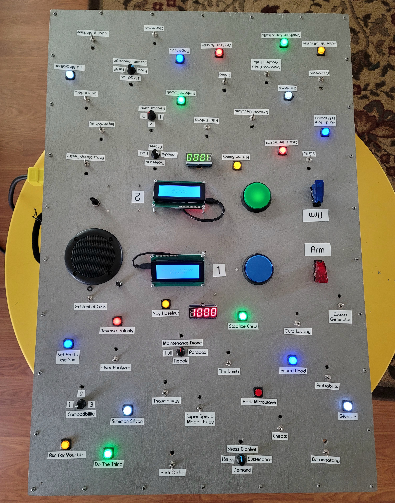

# Panic Stations


This is the code for our Two Player Coop Panel project. It is based on the "Push The Button" game built and coded for the 2018 Winter ICT Game Jam. That code can be seen at the [ictGameJamWinter2018](https://github.com/chrisl8/ictGameJamWinter2018) repository.

# Description

This game is a physical game, in that it is built with an Arduino and lots of buttons and switches.
You won't really be able to play it without building something.

This game is inspired by the mobile game SpaceTeam.

For my panel this code runs on a Raspberry Pi, although it works just as well on a PC. The Pi just allows me to make the project self contained.

## Raspberry Pi Setup

This is intended to run on a Raspberry Pi running **Raspbian** Lite.

Put a fresh copy of Raspbian (RASPBERRY PI OS LITE 32-BIT) on your Raspberry Pi then run the installation script below.

## Install
There is a script to install everything. Run:

```
bash <(wget -qO- --no-cache -o /dev/null https://raw.githubusercontent.com/chrisl8/PanicStations/original/setup.sh)
```

Be sure to read the instructions that the script will print at the end about editing the config files in `~/.RobotAnything/`

**A reboot will be required after the first install.**

## Setup

There are some settings that you may need to tweak in `node/settings.js`. These should be in some non-committed file, but that is a project for a future update.

## Running the game

If you ran the setup script, it should all be working after your first reboot.  
There are shell scripts to stop, start, restart, and view the log.

## Hardware Setup

### Arduino
The code itself is [Johnny-Five](http://johnny-five.io/) based, and requires Arduinos with the correct firmatta installed to read the button input, write the LED input, and communicate with this code running on your PC or Pi.

Because I am using code to control Neopixels, you need a different Firmata for the Neopixel library to work.
I wasn't able to make any of the automated programs written work,
so I did this:

1. Open up the Arduino program.
2. Open the file `PanicStations/node/node_modules/node-pixel/firmware/build/node_pixel_firmata/node_pixel_firmata.ino` from the node_modules folder.
3. Upload it to the Arduino like any program.

If you just have the normal Firmata on the board instead of the special node_pixel version, you will get this error:
IncorrectFirmataVersionError: Please upload NodePixel Firmata to the board

### Hardware Notes

Pins 6 & 7 are the lowest two pins I can seem to use the ARM switches on.
I'm not sure what is up with pins 0 to 5. Need to look that up.

Potentiometers must be powered with FIVE volts from Arduino, not the 3.3v line.

To use Analog pins as Digital, use a number by adding the next pin up (54) to the A number.

Using pins:
Switches: 32-53
Small Buttons: 2-5, 8-13, 22-31

### Version 1.0 Improvements:
    * Better box with fancy metalic looking paint.
    * Character Displays on board so you don't have to look up at a monitor/TV to get your directions.
    * 10 buttons per side instead of 5
    * 11 switches per side instead of 5
    * More "randomized" pattern for layout
    * Lots of playability improvements in the code, but the game play logic is still the same.
        * Positive "SUCCESS" confirmation when you perform your task before your team mate does.
        * Knobs register when they leave the correct zone before your team mate performs their command

### Future Enhancements/TODO
    * Lights on the switches and the knobs
        * That is what the extra holes are for.
    * Volume control
    * Improved text and "interactivity" from system as you do things.
    * String of lights along the side to indicate progress/score/etc.
    * Alternate game modes
        * Self driven Demo mode that just flasehs lights
        * User driven demo mode where it just makes sounds and flashes lights when you push buttons an dturn knows.
        * Use lights to "signal" which thing to switch when time runs short.
        * Mode with no commands, just lights to say "push this"
        * Single player mode
        * Competitive mode
            * Not really sure how to do this.
    * Add pre-game menu options:
        * Set player count?
        * Set easy/normal/hard difficultly.
    * Set "mode" for things like:
        * Not game, just push buttons for noise and lights.
        * "DEMO" Mode where it just makes lights
        * "ENDLESS" mode where the game never ends, you just keep doing the next thing (no timer, or failure doesn't count against you)

    * Adjust screen brightness and contrast (should reset to default on reboot/power cycle)

    * Option to "Swap" LCD displays (and save port) if they are wrong.

